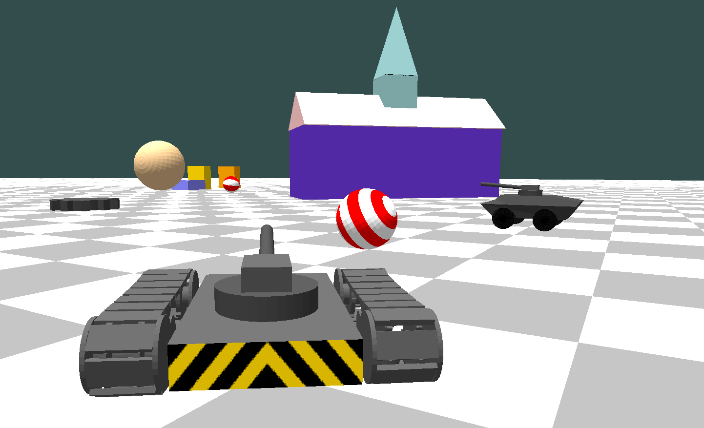

# Vehicle Simulation



This simulation program lets you build a 3D world and drive a vehicle to explore it.

## How to build and run

1. Visual Studio 2022 is needed to build this program. Get the community edition [here](https://visualstudio.microsoft.com/thank-you-downloading-visual-studio/?sku=Community&channel=Release&version=VS2022&source=VSLandingPage&cid=2030&passive=false).

2. Run [bootstrap.cmd](bootstrap.cmd) in a command prompt window from the top of the working tree. The script downloads necessary libraries into the ***third_party*** directory above the working tree so that it can be shared among multiple projects.

3. Open [veh-sim.sln](veh-sim.sln) in Visual Studio, build solution and run. There are other ways to run:

    * Run from command prompt by supplying the path to the scene file as argument: 
        ```
        cd <working tree>\x64\Release
        veh-sim.exe ..\..\scene_desc.json
        ```
    * Run as a game server by specifying the network port number in addition to the path of the scene file:  
        ```
        veh-sim.exe server=<port> ..\..\scene_desc.json
        ```
    * To join a game, specify any IPv4 address or network name of the server and the port number:
        ```
        veh-sim.exe join=<server>:<port>
        ```

4. You can run the game in a web browser:
    * Run game server following the step above using network port **9001**:
        ```
        veh-sim.exe server=9001 ..\..\scene_desc.json
        ```
    * Run a web server to serve the web page. You need to have Python installed on your system and in the Windows path. Then run:
        ```
        cd <working tree>\web
        run.cmd
        ```
    * You should see this output:
        ```
        Serving HTTP on :: port 9000 (http://[::]:9000/) ...
        ```

    * Open a web browser then enter the URL: http://localhost:9000/

5. Read the [documentation](docs/scene_desc.md) and [examples](docs/examples.json) on how to build your own scene.

## How to play

Vehicle movements:

* **Up arrow**: move forward
* **Down arrow**: move backward
* **Left arrow**: turn left
* **Right arrow**: turn right
* **Space**: brake
* **Enter**: fire a shell
* **Mouse movement**: look around
* **Right mouse button + mouse movement**: aim
* **Left mouse button**: fire bullets
* **ESC**: exit

Camera movements when it is not following the player vehicle:

* **W**: move forward
* **S**: move backward
* **A**: side step left
* **D**: side step right
* **Page Up**: increase elevation
* **Page Down**: decrease elevation
* **Mouse movement**: look around

## Resources

* [LearnOpenGL](https://learnopengl.com/): Very useful website for graphics programming with OpenGL, creating 2D games, and using sounds
* [Bullet 3D Physics](https://pybullet.org/): 3D physics library
* [GLFW](https://www.glfw.org/): Library for OpenGL API
* [glm](https://glm.g-truc.net/): OpenGL Mathematics library
* [stb](https://github.com/nothings/stb): Single-file public domain libraries for C/C++
* [Boost](https://www.boost.org/): Free peer-reviewed portable C++ source libraries 
* [JSON](https://www.json.org/): Introduction to JSON 
* [JSON lint](https://jsonlint.com/): JSON validator and reformatter

## Feedback

File an [issue](https://github.com/isaacchou/veh-sim/issues) to report a bug or request a feature, or start a [discussion](https://github.com/isaacchou/veh-sim/discussions) for questions. Please observe the [GitHub Community Code of Conduct](https://docs.github.com/en/site-policy/github-terms/github-community-code-of-conduct) while using this website.

## License

Licensed under the [MIT License](LICENSE).
